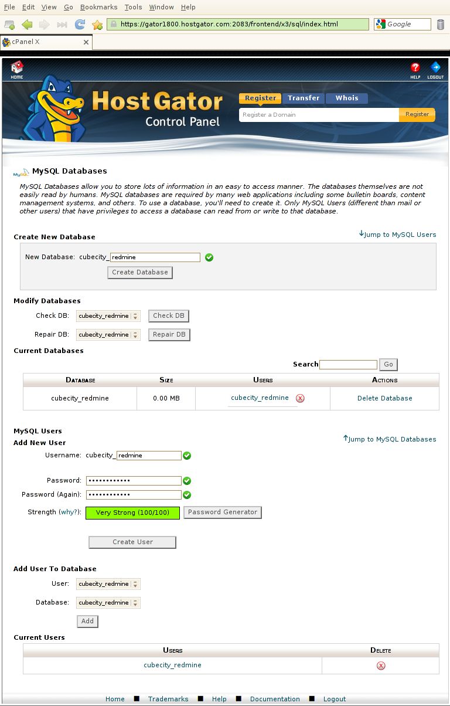
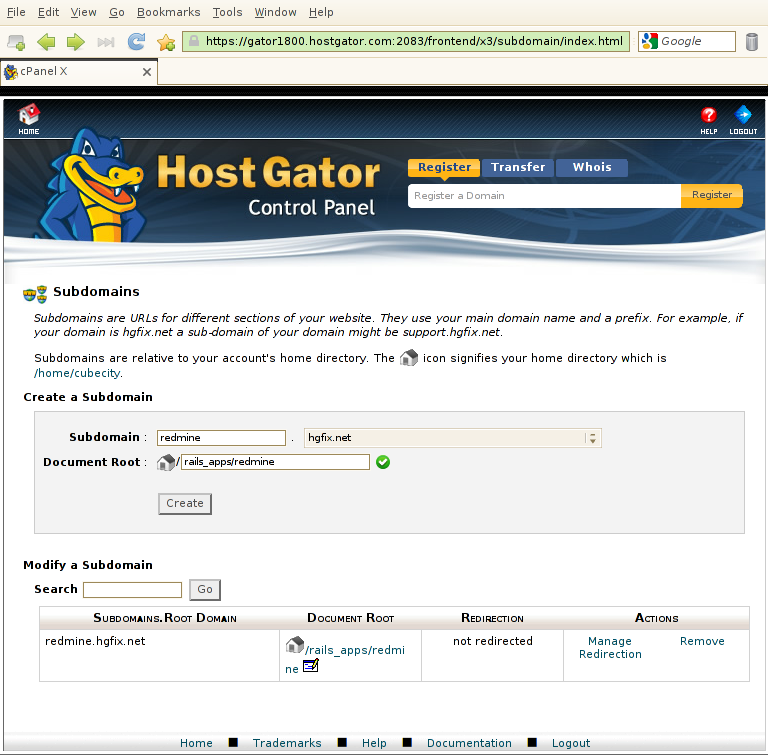
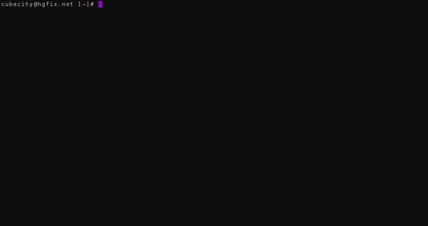
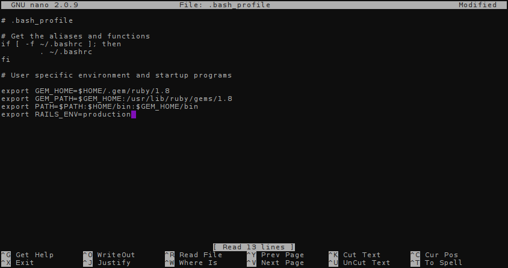
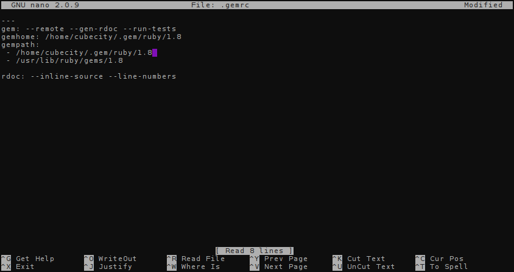
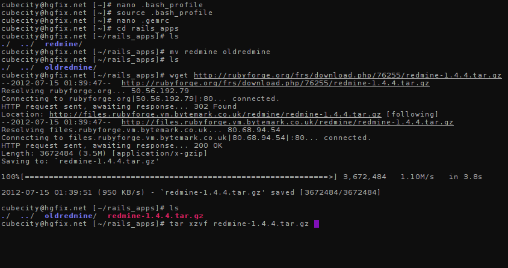
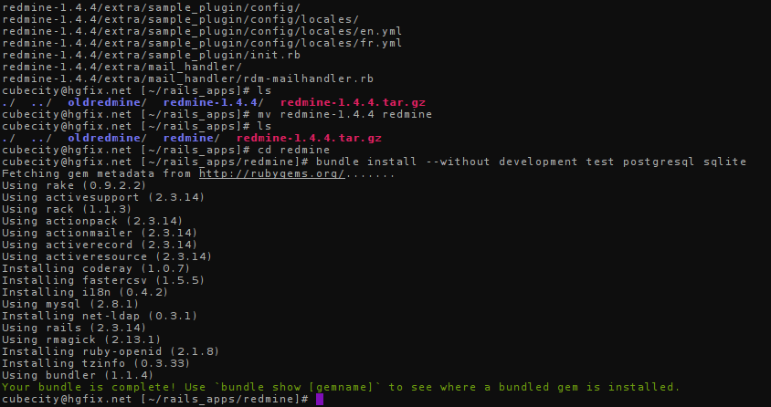
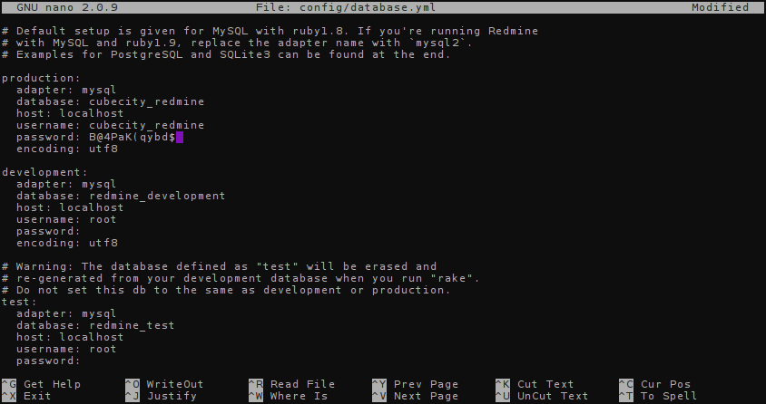
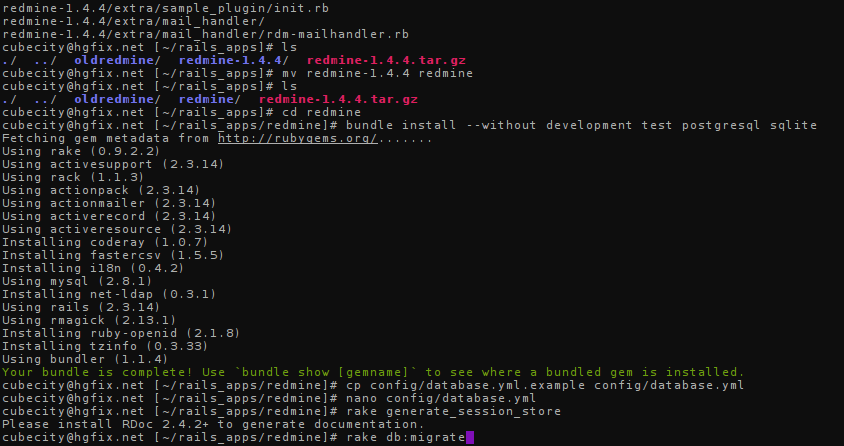

+++
title = "Installing Redmine 1.4 on cPanel Shared Hosting"
date = 2013-02-26T16:35:00Z

[taxonomies]
categories = ["code"]
#tags = ["ruby on rails", "cpanel", "hostgator", "redmine"]
+++
Redmine 1.4.6 (and earlier) can be installed in a shared environment. This 
article will detail the easiest and most reliable method of getting a Redmine 
instance set up on a shared cPanel web hosting account, using `mod_passenger` 
instead of Mongrel.

I wrote this article a while ago when cPanel 11.32 was the most recent version, 
which used Rails 2.3.14, but most of it should still apply with cPanel 11.36 
and Rails 2.3.17. [Redmine 2.2 requires Rails 3.x][5], and as a result is not 
likely to be supported on shared servers (though with root access, you could 
set up Rails 3 in a server using cPanel, but that's beyond the scope of this article).

This article was also written for a HostGator shared hosting account, so 
I can't vouch for other providers like DreamHost, so please feel free to 
contact me letting me know if this setup works on other providers using 
cPanel (as I'd like to believe).

**Note:** Ensure that you have SSH access enabled on your account before 
proceeding! You will need to be somewhat familiar with using SSH before 
you install Redmine in any way. Please see ["How do I get and use SSH access?"][1] 
for more information.

### Step 1 - Setup database and subdomain

Go to your cPanel (this is the only time you will need to), and create a 
database to be used for your Redmine. See ["How do I create a MySQL database..."][2] 
for more information. You can also reference the following screenshot:

We'll call ours `cubecity_redmine`. Be sure to save your password, as you'll 
need it later on.

Next, [create a subdomain][3] and point it to the `public` directory of 
where you will place your Redmine instance. We'll be using `rails_apps/redmine/public` 
in this example:

Note: It is not necessary to use a subdomain - you can definitely use a 
subdirectory or your primary domain, just be sure to make the appropriate 
changes. For simplicity and ease of maintenance, we will use a subdomain 
in this article.

Now that we have these set up, let's start configuring our environment for 
Rails applications.

### Step 2 - Setup your Rails environment

Connect to your account via SSH. The following should look similar to where 
you're at now:

We will now want to edit our shell's environment variables, so that it knows 
where to find our ruby gems. You can use any text editor - we'll use `nano` 
in our examples. Type the following:

    nano ~/.bash_profile

This will open up the `nano` editor. You will want to add or ensure that 
the following variables are in your `.bash_profile`:

    export GEM_HOME=$HOME/.gem/ruby/1.8
    export GEM_PATH=$GEM_HOME:/usr/lib/ruby/gems/1.8
    export PATH=$PATH:$HOME/bin:$GEM_HOME/bin
    export RAILS_ENV=production

You can navigate the file using your arrow keys. Save it by pressing Ctrl+X 
(by pressing Ctrl and the X key at the same time). It may ask to save your 
changes, so press `y` and then click enter to save it.

After this, type the following so that your environment variables are reloaded 
from your profile:

    source ~/.bash_profile

Now we will want to edit our rubygems configuration file. Open `.gemrc` 
in `nano` as you did with `.bash_profile` above.

    ---
    gem: --remote --gen-rdoc --run-tests
    gemhome: /home/cubecity/.gem/ruby/1.8
    gempath:
     - /home/cubecity/.gem/ruby/1.8
     - /usr/lib/ruby/gems/1.8
    rdoc: --inline-source --line-numbers

If the file is empty, type all of the above. Ensure that your `gempath` 
and `gemhome` keys use your own username. Mine is `cubecity` in the above, 
so just replace that. Save the file using Ctrl+X after you are done.

That's it! Your environment is set up, so now let's go into downloading 
and installing Redmine.

### Step 3 - Download and Install Redmine

Let's first move out the folder created by cPanel when we went to make a 
subdomain. Run the following commands:

    cd rails_apps
    mv redmine oldredmine

Now we want to download the latest version of Redmine 1.4. Visit the 
[RubyForge page for Redmine][4] and find the tarball for latest Redmine. 
We'll use 1.4.4 as that is the latest at this time of writing, and download 
it directly to the server like below:

    wget http://rubyforge.org/frs/download.php/76255/redmine-1.4.4.tar.gz

You will then want to extract the tarball. Use the following to extract it:

    tar xzvf redmine-1.4.4.tar.gz

Your session should look similar to this before you extract the file:

After you've finished untarring the download, rename your extracted directory 
to `redmine` using the `mv` command and go into that directory:

    mv redmine-1.4.4 redmine
    cd redmine

We will be using Bundler to install Redmine's dependencies. Bundler should 
be available on the shared server, but if it is not, you can locally install 
a copy by running `gem install bundler`. As we will be using MySQL, issue 
the following:

    bundle install --without development test postgresql sqlite

Your session should now look like this:

Redmine's installed! Now let's finish up and configure it...

### Step 4 - Configure Redmine

Copy over the example database configuration provided by Redmine and start 
editing it, like below:

    cp config/database.yml.example config/database.yml
    nano config/database.yml

Edit your configuration for the production environment with the database 
name, user, and password you created at the beginning of this tutorial:

Press Ctrl+X to save. Now let's run our initial Rake tasks to create a secret 
and set up your database's tables:

    rake generate_session_store
    rake db:migrate

Finally, we will edit our `.htaccess` so that mod_passenger can handle requests 
for your Redmine instance:

    nano public/.htaccess

Add the following two lines:

    Options -MultiViews
    RailsBaseURI /

Press Ctrl+X to save, and you're done! Visit the subdomain you created in 
step 1, and your Redmine installation should be handling requests as normal.

This method requires no stopping or starting of services, however if you 
find (very rarely this will occur) that you need to restart your app, create 
a `restart.txt` file in your application:

    touch tmp/restart.txt

The application will restart the next time it is loaded in a browser.

Have fun resolving bugs!

[1]: http://support.hostgator.com/articles/hosting-guide/lets-get-started/how-do-i-get-and-use-ssh-access
[2]: http://support.hostgator.com/articles/cpanel/how-do-i-create-a-mysql-database-a-user-and-then-delete-if-needed
[3]: http://support.hostgator.com/articles/cpanel/please-read-before-creating-a-subdomain
[4]: http://rubyforge.org/frs/?group_id=1850
[5]: http://www.redmine.org/projects/redmine/wiki/RedmineInstall#Ruby-interpreter
