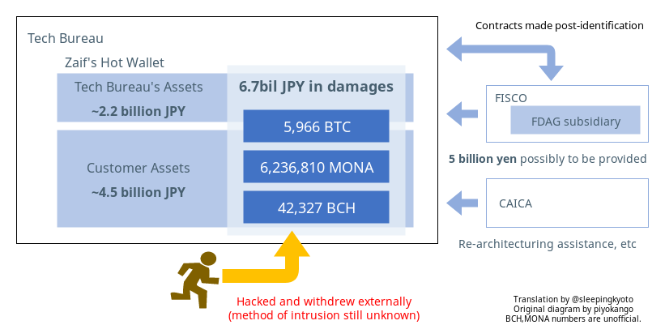

+++
title = "Notes from Zaif Attack"
description = "A translation of an article regarding the late 2018 breach into the Zaif cryptocurrency exchange."
date = 2018-09-20T17:25:00Z

[taxonomies]
categories = ["news"]
tags = ["translation", "cryptocurrency"]

[extra.opengraph]
image = "./zaif-incident.png"

[extra.twitter]
card = "summary_large_image"
image_alt = "Diagram of the flow of involved monetary assets."
+++

*The following is primarily a translation of [this blog post][].*

On September 20, 2018, Tech Bureau sent out a notice that they suspended
deposits and withdrawals for three currencies (BTC, MONA, BCH) on the Zaif
cryptocurrency exchange due to unauthorized access to its systems. This post is 
an aggregation of the details of that event.

### Press Releases

#### Tech Bureau

* September 20, 2018 [仮想通貨の入出金停止に関するご報告、及び弊社対応について][] (Regarding the suspension of cryptocurrency deposits/withdrawals and how to contact us about it.)

### Incident Timeline

<table>
<tr><th>Time</th><th>Event</th></tr>
<tr><td>2018.09.14 between 17:00-19:00</td><td>Approximately 6.7 billion JPY worth of assets were withdrawn without authorization.</td></tr>
<tr><td>2018.09.17</td><td>Tech Bureau detected an anomaly within the environment.</td></tr>
<tr><td> - evening</td><td>Tech Bureau suspended withdrawals/deposits for 3 currencies on Zaif.</td></tr>
<tr><td>2018.09.18</td><td>Tech Bureau identified they had suffered a hacking incident.</td></tr>
<tr><td> - same day</td><td>Tech Bureau reported the incident to the local finance bureau and started filing papers with the authorities.</td></tr>
<tr><td> - same day</td><td>The official Zaif Twitter account tweeted that <a href="https://twitter.com/zaifdotjp/status/1041881617516716032">customer financial assets are safe</a>.</td></tr>
<tr><td> - same day</td><td>In accordance with the Payment Services Act, the FSA issued a Request for Report to Tech Bureau.</td></tr>
<tr><td>Post-identification</td><td>Tech Bureau enters into a contract with Fisco for financial support.</td></tr>
<tr><td>Post-identification</td><td>Tech Bureau enters into a contract with CAICA for assistance in improving security.</td></tr>
<tr><td>2018.09.20 ~2am</td><td>Tech Bureau <a href="https://twitter.com/zaifdotjp/status/1042473285353660416">issues a press release</a> declaring that deposits/withdrawals were suspended due to a hacking operation.</td></tr>
<tr><td> - same day</td><td>The Japan Cryptocurrency Business Association appealed for a member to perform an emergency inspection.</td></tr>
<tr><td> - same day</td><td>The FSA sent an on-site inspection crew to Tech Bureau.</td></tr>
<tr><td>2018.09.21</td><td>ETA for the FSA to issue a report on its investigation about the status of customer assets to the cryptocurrency exchange's traders.</td></tr>
</table>

### Damage

* Approximately 6.7 billion JPY worth of 3 different currencies were withdrawn externally without authorization.
* Withdrawals and deposits for the 3 affected currencies have been suspended since the evening of 17 September.
  * Withdrawals/deposits are [still possible on other coins](https://twitter.com/peperibito/status/1042724925272805376).

### Itemization of damages

<table>
<tr><td><strong>Tech Bureau's own assets</strong></td><td>~2.2 billion JPY</td></tr>
<tr><td><strong>Customer assets</strong></td><td>~4.5 billion JPY</td></tr>
</table>

* Tech Bureau has shown that they can cover the 4.5b loss of customer assets
  through financial assistance from the FDAG subsidiary.

## Information around the Zaif hack itself

* Funds were withdrawn from the server managing the Zaif hot wallet.
* Tech Bureau is still investigating the exact method of intrusion, but it
  doesn't look like they'll publicly announce it as a protective measure.

## Details on the unauthorized transactions

### Total (estimated) damages on the 3 currencies

<table>
<tr><th>Currency</th><th>Amount transferred</th><th>JPY conversion</th><th>USD conversion</th></tr>
<tr><td>Bitcoin</td><td>5966 BTC</td><td>4.295 billion JPY</td><td>38.207 million USD</td><tr>
<tr><td>Monacoin</td><td>Under investigation, but sources estimate 6,236,810 MONA</td><td>650 million JPY</td><td>5.782 million USD</td></tr>
<tr><td>Bitcoin Cash</td><td>Under investigation, but sources estimate 42,327 BCH</td><td>2.019 billion JPY</td><td>17.954 million USD</td></tr>
</table>

### Assumed recipient addresses of the hack

<table>
<tr><th>Currency</th><th>Address</th><th>Time of transaction</th></tr>
<tr><td>Bitcoin</td><td><a href="https://explorer.bitcoin.com/btc/address/1FmwHh6pgkf4meCMoqo8fHH3GNRF571f9w">1FmwHh6pgkf4meCMoqo8fHH3GNRF571f9w</a></td><td>2018.09.14, between 17:33:27 and 18:42:30</td></tr>
<tr><td>Bitcoin Cash</td><td><a href="https://explorer.bitcoin.com/bch/address/bitcoincash:qrn0jwaq3at5hhxsne8gmg5uemudl57r05pdzu2nyd">qrn0jwaq3at5hhxsne8gmg5uemudl57r05pdzu2nyd</a></td><td>2018.09.14, between 17:33:15 and 17:51:24</td></tr>
<tr><td>Monacoin</td><td><a href="https://bchain.info/MONA/addr/MBEYH8JuAHynTA7unLjon7p7im2U9JbitV">MBEYH8JuAHynTA7unLjon7p7im2U9JbitV</a></td><td>2018.09.14, between 17:39:01 and 18:54:10</td></tr>
</table>

* A source [points out a portion of the Bitcoin were sent to an address owned by Binance (exchange)](https://twitter.com/ETHxCC/status/1042591758369009665).
* As can be seen from Tech Bureau's address, Bitcoin was sent from 1726 accounts to 1 account.
* Tech Bureau informants have confirmed that this transaction is related to the hack in the press release.
* The hacker appears to have used a mixing service for the pooled Bitcoin. ([匿名化サービス悪用、追跡困難か　Ｚａｉｆ仮想通貨流出,朝日新聞,2018年9月20日](https://digital.asahi.com/articles/ASL9N56MYL9NULFA02C.html?rm=531))
* The stolen Monacoin (62,389,425 Mona) amounts to about 10% of all mined coins.
* The Bitcoin Cash appears to have been transferred to yet another address ([qpyh6tw42h5pyl84py4c3ukqamsz0ucyly04nyz8u7](https://explorer.bitcoin.com/bch/address/17haHbYSxbvQae4ddB9iTGWpPNwaMC1jMd)) at around 8:10pm.

*work in progress*

  
*Disclaimer: I make no guarantees of the accuracy of the above article.* 
*Please see the official press releases and/or PR department at Zaif. I am also
not affiliated with Zaif or any of the companies mentioned in this article.*

[this blog post]: http://d.hatena.ne.jp/Kango/20180920/1537414861
[仮想通貨の入出金停止に関するご報告、及び弊社対応について]: https://prtimes.jp/main/html/rd/p/000000093.000012906.html
